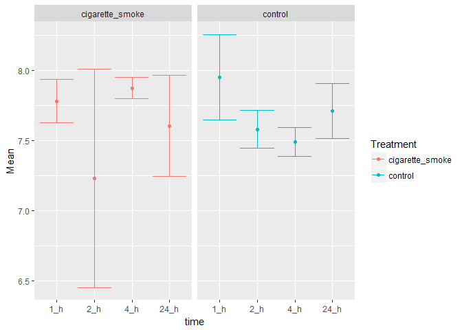
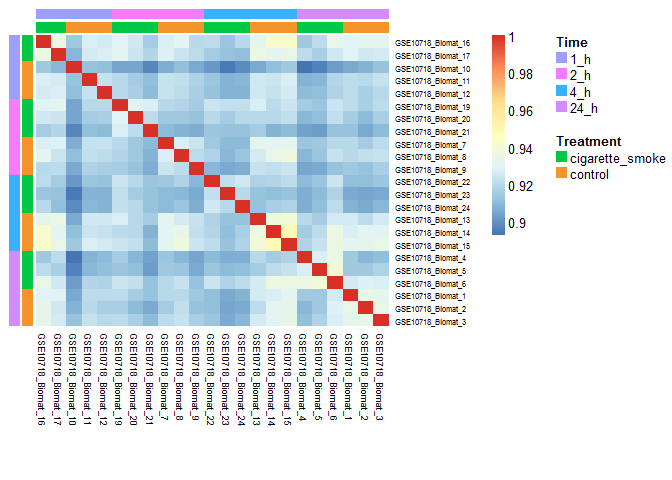
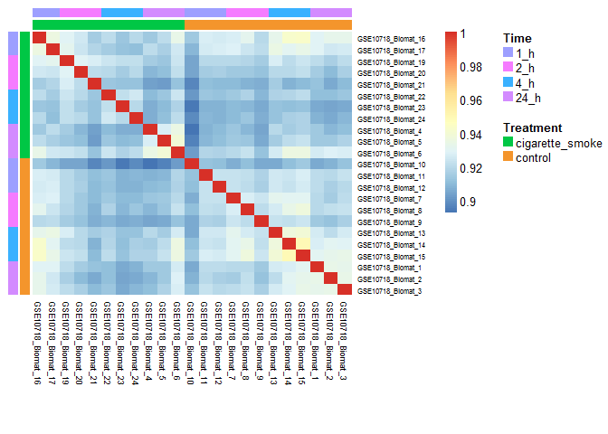
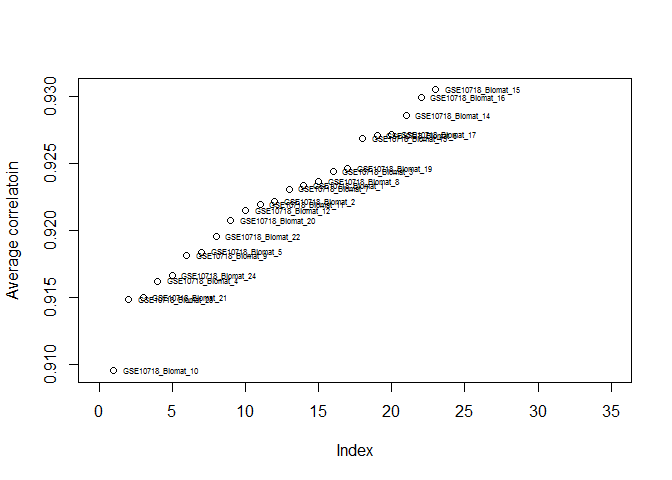
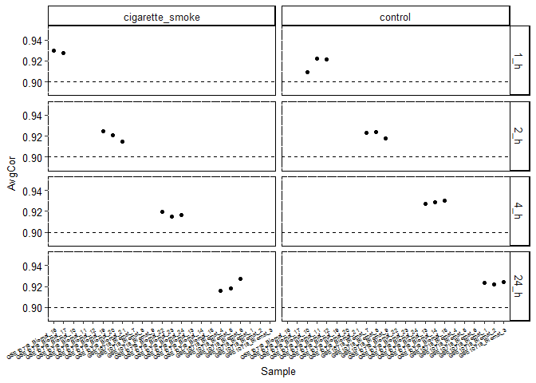
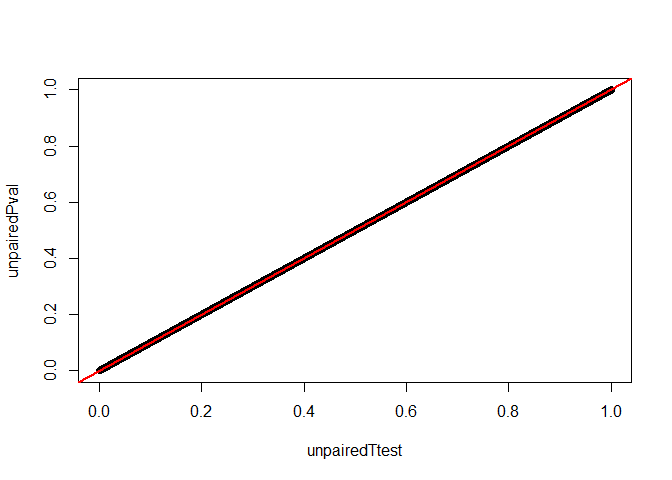
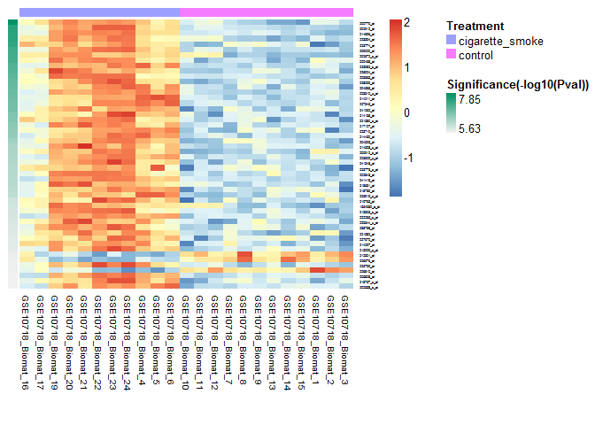
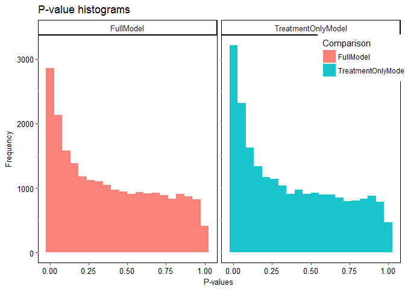
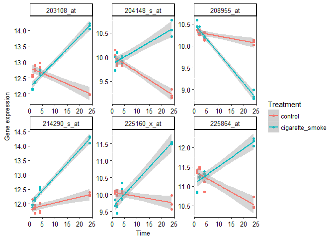
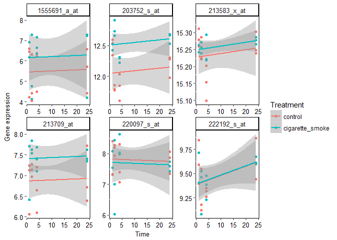

Homework
================
Amrit Singh
March 01, 2017

-   [Question 1: Data inspection](#question-1-data-inspection)
    -   [1.1 Download and inspect the data (1 point)](#download-and-inspect-the-data-1-point)
    -   [1.2 Basic data manipulation (1 point)](#basic-data-manipulation-1-point)
    -   [1.3 Basic graphing (1 point)](#basic-graphing-1-point)
-   [Question 2: Assessing data quality](#question-2-assessing-data-quality)
    -   [2.1 Examine the sample-to-sample correlations in a heatmap (2 points)](#examine-the-sample-to-sample-correlations-in-a-heatmap-2-points)
    -   [2.2 Assess the presence of outlier samples (1 point)](#assess-the-presence-of-outlier-samples-1-point)
-   [Question 3: Differential expression with respect to treatment](#question-3-differential-expression-with-respect-to-treatment)
    -   [3.1 Linear model (1 point)](#linear-model-1-point)
    -   [3.2 look at hits](#look-at-hits)
-   [Question 4: Differential expression with respect to time](#question-4-differential-expression-with-respect-to-time)
    -   [4.1 Linear model (1 point)](#linear-model-1-point-1)
-   [Question 5: Differential expression analysis with a full model](#question-5-differential-expression-analysis-with-a-full-model)
    -   [5.1 Quantify the number of hits for treatment (2 point)](#quantify-the-number-of-hits-for-treatment-2-point)
    -   [5.2 Test the null hypothesis (1 point)](#test-the-null-hypothesis-1-point)
    -   [5.3 Plot a few probes where the interaction does and does not matter (2 point)](#plot-a-few-probes-where-the-interaction-does-and-does-not-matter-2-point)

Question 1: Data inspection
===========================

Paper abstract: Gene expression patterns were assessed in normal human bronchial epithelial (NHBE) cells exposed to cigarette smoke (CS) from a typical "full flavor" American brand of cigarettes in order to develop a better understanding of the genomic impact of tobacco exposure, which can ultimately define biomarkers that discriminate tobacco-related effects and outcomes in a clinical setting. NHBE cells were treated with CS for 15 minutes and alterations to the transcriptome assessed at 1,2,4 and 24 hours post-CS-exposure using high-density oligonucleotide microarrays.

1.1 Download and inspect the data (1 point)
-------------------------------------------

``` r
eset <- read.table(gzfile('../homework_data/NHBE_transcriptome_data.txt.gz'))
pDat0 <- read.delim("../homework_data/NHBE_design.txt")
all(colnames(eset) == rownames(pDat0))  # samples are in the same order!
```

    ## [1] TRUE

``` r
## re order samples
pDat <- pDat0[colnames(eset), ] %>% 
  mutate(rowNames = rownames(.), 
    time = factor(time, levels = c("1_h",  "2_h", "4_h", "24_h")))
```

### How many genes are in our data? How many samples?

> There are 22737 genes and 23 samples

### Do you think it's a good experiment design?

``` r
(A <- table(pDat$Treatment, pDat$time))
```

    ##                  
    ##                   1_h 2_h 4_h 24_h
    ##   cigarette_smoke   2   3   3    3
    ##   control           3   3   3    3

``` r
addmargins(A)
```

    ##                  
    ##                   1_h 2_h 4_h 24_h Sum
    ##   cigarette_smoke   2   3   3    3  11
    ##   control           3   3   3    3  12
    ##   Sum               5   6   6    6  23

> Yes, given that this is a cell-line (NHBE cells), where there is little cell to cell biological variability, a limited sample size (~3) can be used. A balanced study design is used (execpt for one group which contains 2 samples), which have more power compared to unbalanced study designs. <http://stats.stackexchange.com/questions/44542/experiment-design-can-unbalanced-dataset-be-better-than-balanced>

1.2 Basic data manipulation (1 point)
-------------------------------------

``` r
# as numeric time variables
pDat$Time.numeric <- as.numeric(gsub("_h", "", as.character(pDat$time)))
```

1.3 Basic graphing (1 point)
----------------------------

``` r
# plot probe graph
pDat %>% mutate(randomProbe = as.numeric(eset[1,])) %>% 
  group_by(Treatment, time) %>% 
  dplyr::summarise(Mean = mean(randomProbe), SD = sd(randomProbe)) %>% 
  ggplot(aes(x = time, y = Mean, color = Treatment)) + 
  geom_point() + geom_errorbar(aes(ymin = Mean-SD, ymax = Mean+SD)) + facet_wrap(~Treatment) 
```



Question 2: Assessing data quality
==================================

2.1 Examine the sample-to-sample correlations in a heatmap (2 points)
---------------------------------------------------------------------

``` r
## time-trt
corMat <- cor(eset, method = "spearman")
ord1.dat <- pDat %>% arrange(time, Treatment)
ord1 <- as.character(ord1.dat$rowNames)
ord1.lab <- list(Time = ord1.dat$time, Treatment = ord1.dat$Treatment)
NMF::aheatmap(corMat[ord1, ord1], 
  annCol = ord1.lab, annRow = ord1.lab, Rowv = NA, Colv = NA)
```



``` r
## trt-time
ord2.dat <- pDat %>% arrange(Treatment, time)
ord2 <- as.character(ord2.dat$rowNames)
ord2.lab <- list(Time = ord2.dat$time, Treatment = ord2.dat$Treatment)
NMF::aheatmap(corMat[ord2, ord2], 
  annCol = ord2.lab, annRow = ord2.lab, Rowv = NA, Colv = NA)
```



> hard to determine which factor (time or treatment) has a great effect across all genes \#\#\#\# Note the type of correlation metric may differ between students (for next year specify type of correlation)

2.2 Assess the presence of outlier samples (1 point)
----------------------------------------------------

> based on the heatmaps, GSE10718\_Biomat\_10 seems like an outlying sample

### quantify for each sample, whether it "sticks out" compared to the other samples.

``` r
avgCor <- rowMeans(corMat)
range(avgCor)
```

    ## [1] 0.9095343 0.9304582

``` r
plot(avgCor[order(avgCor)], ylab = "Average correlatoin", xlim = c(0, 35))
text(avgCor[order(avgCor)], labels = names(avgCor[order(avgCor)]), cex = 0.5, pos = 4)
```

 &gt; Although GSE10718\_Biomat\_10 seems like an outlier, the average correlation of each sample with all other samples is greater than 0.9, therefore there is not enough evidence for any outliers

### examine it in the context of its experimental group

``` r
all(pDat$rowNames == rownames(corMat))
```

    ## [1] TRUE

``` r
corMat %>%
  as.data.frame %>% 
  mutate(Sample1 = rownames(.),
    Treatment = pDat[, "Treatment"],
    Time = pDat[, "time"]) %>% 
  gather(Sample2, Correlation, -c(Sample1:Time)) %>% 
  group_by(Sample1, Treatment, Time) %>% 
  dplyr::summarise(AvgCor = mean(Correlation)) %>% 
  arrange(Time, Treatment) %>% ungroup %>% 
  mutate(Sample = factor(Sample1, levels = Sample1)) %>% 
  ggplot(aes(x = Sample, y = AvgCor)) +
  geom_point() +
  facet_grid(Time ~ Treatment) +
  ylim(c(0.89,0.95)) +
  customTheme(sizeStripFont = 10, xAngle = 30, hjust = 1, 
    vjust = 1, xSize = 5, ySize = 10, xAxisSize = 10, yAxisSize = 10) +
  geom_hline(yintercept = 0.9, linetype = "dashed")
```



> samples within each group well, not enough evidence to remove any observations

Question 3: Differential expression with respect to treatment
=============================================================

3.1 Linear model (1 point)
--------------------------

``` r
pDat$Treatment <- relevel(pDat$Treatment, ref = "control")
design <- model.matrix(~Treatment, data = pDat)
fit <- eBayes(lmFit(eset, design))
```

> We are comparing all 12 controls samples with all 11 cigaretter smoke samples. We are essentially performing an unpaired t.test, however limma moderates the genewise variables so the two tests are not exactly the same. The unmoderated linear model is the same as the unpaired test (with equal variance).

``` r
unpairedTtest <- apply(eset, 1, function(i){
  t.test(i[pDat$Treatment == "cigarette_smoke"], i[pDat$Treatment == "control"], var.equal = TRUE)$p.value
})

ordinary.t <- fit$coef / fit$stdev.unscaled / fit$sigma
unpairedPval <- lapply(ordinary.t[, "Treatmentcigarette_smoke"], function(i){
  2*pt(-abs(i), df = fit$df.residual[1], lower.tail = TRUE)
}) %>% unlist

plot(unpairedPval ~ unpairedTtest)
abline(a = 0, b = 1, col = "red", lwd=2)
```



3.2 look at hits
----------------

### How many hits (probes) are associated with treatment at unadjusted p-value 1e-3? How may are associated with treatment at FDR 0.05?

``` r
top.trt <- topTable(fit, coef = 2, adjust.method = "none", n = Inf)

pvalCutoff <- 0.001
fdrCutoff <- 0.05
```

> There are 805 significant genes a p-value cut-off of 0.001

``` r
fdr.trt <- p.adjust(top.trt$P.Value, "BH")
```

> There are 1238 significant genes a p-value cut-off of 0.05

### Take the top 50 probes as your "hits" and create a heatmap of their expression levels. Sort the hits by p-values and the samples by treatment.

``` r
# heatmap to top 50 hits
k = 50
eset.top <- t(apply(eset[rownames(top.trt)[1:k], ord2], 1, scale))
colnames(eset.top) <- ord2
ord1.lab <- list(Treatment = ord2.dat$Treatment)
NMF::aheatmap(eset.top, 
  annCol = list(Treatment = ord2.dat$Treatment), 
  annRow = list('Significance(-log10(Pval))' = -log10(top.trt$P.Value)[1:k]), 
  Rowv = NA, Colv = NA)
```



### What is the (estimated) false discovery rate of this "hits" list?

``` r
# F/S
# estimate number of false positives
## 50th pvalue
alpha = top.trt$P.Value[k]

## by definition of the p-value, under the null, the Prob(p < alpha) = alpha
f = alpha*nrow(eset) # number of false discoveries

s = 50 # number of signficant findings
```

> The estimate of the FDR is 0.0010684

### How many of these hits do we expect to be false discoveries?

> Number of hits that are false positives equals 0.05342 probes.

Question 4: Differential expression with respect to time
========================================================

4.1 Linear model (1 point)
--------------------------

``` r
design <- model.matrix(~Time.numeric, data = pDat)
fit <- eBayes(lmFit(eset, design))
top.time <- topTable(fit, coef = 2, adjust.method = "BH", n = Inf)
```

There are 958 significant probes at a p-value cut-off of 0.001 and 1451 signficant probes at a FDR cut-off 0.05

Question 5: Differential expression analysis with a full model
==============================================================

5.1 Quantify the number of hits for treatment (2 point)
-------------------------------------------------------

### For how many probes is treatment a significant factor at the unadjusted p-value 1e-3, and at FDR 0.05 level?

``` r
design <- model.matrix(~Time.numeric*Treatment, data = pDat)
fit <- eBayes(lmFit(eset, design))
topFull.trt <- topTable(fit, coef = "Treatmentcigarette_smoke", adjust.method = "BH", n = Inf)
```

There are 621 significant probes affeted by treatment at a p-value cut-off of 0.001 and 768 signficant probes affected by treatment at a FDR cut-off 0.05

### Is this number different from what you reported in 3.2? Why?

``` r
sum(top.trt$P.Value < pvalCutoff) == sum(topFull.trt$P.Value < pvalCutoff)
```

    ## [1] FALSE

> not the same number. The first model doesn't adjust for the time effect. That is, in the second model, these probes are affected by treatment indepdent of the effect of time.

### Quantify the proportion of overlapping probes among your hits, when using the unadjusted p-value threshold of 1e-3.

``` r
overlap <- length(intersect(rownames(top.trt)[top.trt$P.Value < pvalCutoff], rownames(topFull.trt)[topFull.trt$P.Value < pvalCutoff]))

union <- length(unique(c(rownames(top.trt)[top.trt$P.Value < pvalCutoff], rownames(topFull.trt)[topFull.trt$P.Value < pvalCutoff])))
```

> 29.9 % of the signficant probes associated with treatment overlap

### Plot the distributions of all the p-values for treatment when using both models, i.e., one from the model in Q3 and one from the full model in this question. Compare and comment on the similarity/differences in the shape of the distributions.

``` r
data.frame(TreatmentOnlyModel = top.trt$P.Value,
  FullModel = topFull.trt$P.Value) %>% 
  gather(Comparison, p.value) %>% 
  ggplot(aes(x = p.value, fill = Comparison)) +
  geom_histogram(bins=20, alpha=.9, position="identity") +
  customTheme(sizeStripFont = 10, xAngle = 0, hjust = 0.5,
    vjust = 0.5, xSize = 10, ySize = 10, xAxisSize = 10,
    yAxisSize = 10) + 
  facet_wrap(~Comparison) +
 ylab("Frequency") + xlab("P-values") +
  ggtitle("P-value histograms") + 
  theme(legend.position = c(0.9, 0.9))
```



> There are a small number of "small" p-values in the full model (Q5) compared to the Treatment only model (Q3) suggesting that significant p-values in Q3 were dependent on time.

5.2 Test the null hypothesis (1 point)
--------------------------------------

### Explain in English what you are modeling with this interaction term (what does it represent?).

> The interaction is asking does the relationship between time and gene-expression differ between controls and cigarette\_smoke groups

### For how many probes is the interaction effect significant at the unadjusted p-value 1e-3, and at FDR 0.05 level?

``` r
topFull.int <- topTable(fit, coef = "Time.numeric:Treatmentcigarette_smoke", adjust.method = "BH", n = Inf)
```

There are 573 significant probes affeted by treatment at a p-value cut-off of 0.001 and 664 signficant probes affected by treatment at a FDR cut-off 0.05

5.3 Plot a few probes where the interaction does and does not matter (2 point)
------------------------------------------------------------------------------

#### Interaction matters

``` r
eset[rownames(topFull.int)[1:6], ] %>% 
  t %>% as.data.frame %>% 
  mutate(Time = pDat$Time.numeric,
    Treatment = pDat$Treatment) %>% 
  gather(probe, Exp, -c(Time:Treatment)) %>% 
  ggplot(aes(x = Time, y = Exp, color = Treatment)) +
  geom_point() + facet_wrap(~probe, scales = "free") +
  stat_smooth(method = "lm") + 
  customTheme(sizeStripFont = 10, xAngle = 0, hjust = 0.5,
    vjust = 0.5, xSize = 10, ySize = 10,
    xAxisSize = 10, yAxisSize = 10) +
  ylab("Gene expression")
```



#### Interaction doesn't matters

``` r
all(colnames(eset) == pDat$rowNames)
```

    ## [1] TRUE

``` r
eset[rownames(topFull.int)[(nrow(topFull.int)-5):nrow(topFull.int)], ] %>% 
  t %>% as.data.frame %>% 
  mutate(Time = pDat$Time.numeric,
    Treatment = pDat$Treatment) %>% 
  gather(probe, Exp, -c(Time:Treatment)) %>% 
  ggplot(aes(x = Time, y = Exp, color = Treatment)) +
  geom_point() + facet_wrap(~probe, scales = "free") +
  stat_smooth(method = "lm") + 
  customTheme(sizeStripFont = 10, xAngle = 0, hjust = 0.5,
    vjust = 0.5, xSize = 10, ySize = 10,
    xAxisSize = 10, yAxisSize = 10) +
  ylab("Gene expression")
```


