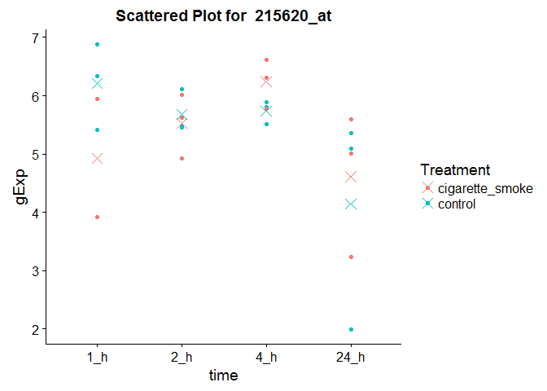
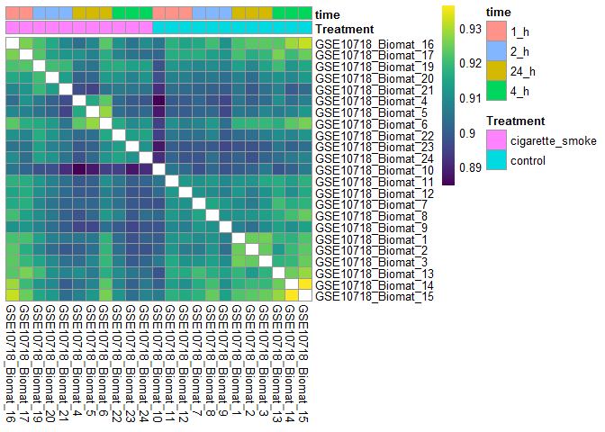
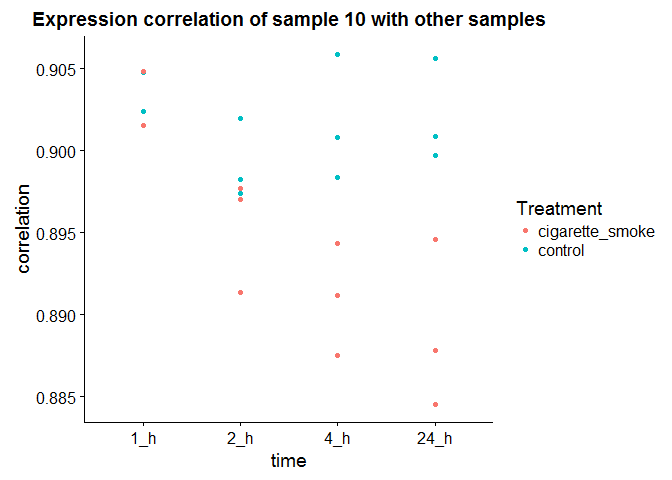
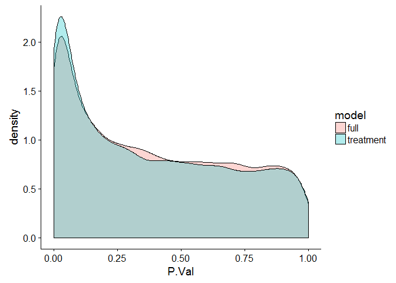
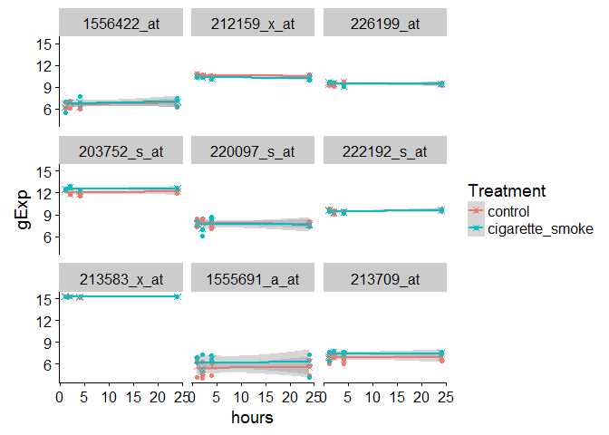

Assignment part 1
================
Santina Lin
March 7, 2017

-   [Question 1 Data inspection](#question-1-data-inspection)
    -   [1.1 Download and inspect the data](#download-and-inspect-the-data)
    -   [1.2 Basic data manipulation](#basic-data-manipulation)
    -   [1.3 Basic graphing](#basic-graphing)
-   [Question 2 Assessing data quality](#question-2-assessing-data-quality)
    -   [2.1 Examine the sample-to-sample correlations in a heatmap](#examine-the-sample-to-sample-correlations-in-a-heatmap)
    -   [2.2 Assess the presence of outlier samples](#assess-the-presence-of-outlier-samples)
-   [Question 3 Differential expression with respect to treatment](#question-3-differential-expression-with-respect-to-treatment)
    -   [3.1 Linear model](#linear-model)
    -   [3.2 Look at the hits](#look-at-the-hits)
-   [Question 4: Differential expression with respect to time](#question-4-differential-expression-with-respect-to-time)
    -   [4.1 Linear model (1 point)](#linear-model-1-point)
-   [Question 5: Differential expression analysis with a full model](#question-5-differential-expression-analysis-with-a-full-model)
    -   [5.1 Quantify the number of hits for treatment](#quantify-the-number-of-hits-for-treatment)
    -   [5.2 Test the null hypothesis](#test-the-null-hypothesis)
    -   [5.3 Plot a few probes where the interaction does and does not matter](#plot-a-few-probes-where-the-interaction-does-and-does-not-matter)

> Hello students, hope the assginment went well. Here's my work on the assignment. It's not super complete but might be useful if you just want to get an idea of the mechanics, coding, and answers.

First I'll load some essential packages that I'll use throughout the assignment.

``` r
# Installing packages from Bioconductor:  
# source("https://bioconductor.org/biocLite.R")
# biocLite("yeast2.db"); biocLite("edgeR"); biocLite("limma")
# The rest were installed through `install.packages()`

library(stringr)  # For string manipulations
library(plyr); library(dplyr)      # Data wrangling. plyr needs to be loaded before dplyr
library(lattice); library(ggplot2); library(RColorBrewer) # For graphing
library(cowplot)  # For making publication ready graphs. This automatically changes the default theme of ggplot
library(viridis)  # Color-blind and greyscale friendly color scales
library(reshape2) # melt() 
library(pheatmap) # Create Heatmap 
library(knitr)    # Rendering pretty tables
set.seed(1)       # Randomization 
library(yeast2.db)# For the microarray questions
library(limma)    # Linear models
library(GGally)   # ggpairs()
library(grid)     # Dependecy for gridExtra
library(gridExtra)# Grid.arrange() for arranging graphs 
library(edgeR)    # Differential expression analysis of RNA-seq 
library(VennDiagram) 
```

Question 1 Data inspection
--------------------------

### 1.1 Download and inspect the data

Reading the files. Note that I'm using relative path here, not absolute paths, so that anyone can use this Rmarkdown. I can do this after I set my working directory to current file.

``` r
NHBE_data <- read.table(gzfile('../homework_data/NHBE_transcriptome_data.txt.gz')) # the probe data
NHBE_des <- read.table('../homework_data/NHBE_design.txt') # the metadata
```

Inspect the data

``` r
str(NHBE_data)
```

    ## 'data.frame':    22737 obs. of  23 variables:
    ##  $ GSE10718_Biomat_1 : num  7.9 6.13 6.82 6.63 6.95 ...
    ##  $ GSE10718_Biomat_10: num  7.62 5.85 7.62 5.7 7.51 ...
    ##  $ GSE10718_Biomat_11: num  8.22 6.3 7.22 6.22 7.29 ...
    ##  $ GSE10718_Biomat_12: num  8.01 5.91 6.17 6.06 7.95 ...
    ##  $ GSE10718_Biomat_13: num  7.61 6.62 7.2 6.89 7.87 ...
    ##  $ GSE10718_Biomat_14: num  7.45 6.82 7.4 7.02 7.55 ...
    ##  $ GSE10718_Biomat_15: num  7.41 6.88 6.78 6.59 7.27 ...
    ##  $ GSE10718_Biomat_16: num  7.67 6.83 6.99 6.45 7.56 ...
    ##  $ GSE10718_Biomat_17: num  7.89 6.45 5.85 6.18 7.24 ...
    ##  $ GSE10718_Biomat_19: num  7.8 6.66 6.83 6.19 6.96 ...
    ##  $ GSE10718_Biomat_2 : num  7.72 6.57 6.67 6.74 7.05 ...
    ##  $ GSE10718_Biomat_20: num  7.55 5.81 6.28 5.57 8.04 ...
    ##  $ GSE10718_Biomat_21: num  6.34 7.06 7.23 5.77 7.62 ...
    ##  $ GSE10718_Biomat_22: num  7.8 6.49 6.75 5.59 7.32 ...
    ##  $ GSE10718_Biomat_23: num  7.95 7.08 7.11 7.14 7.83 ...
    ##  $ GSE10718_Biomat_24: num  7.88 6.24 6.97 6.34 7.03 ...
    ##  $ GSE10718_Biomat_3 : num  7.51 6.38 6.98 6.73 7.06 ...
    ##  $ GSE10718_Biomat_4 : num  7.31 6.89 7.62 6.48 8.46 ...
    ##  $ GSE10718_Biomat_5 : num  8 7.1 7.29 5.72 7.73 ...
    ##  $ GSE10718_Biomat_6 : num  7.5 6.42 7.68 6.28 7.54 ...
    ##  $ GSE10718_Biomat_7 : num  7.5 6.27 7.12 6.63 8.17 ...
    ##  $ GSE10718_Biomat_8 : num  7.51 6.53 6.61 6.52 7.67 ...
    ##  $ GSE10718_Biomat_9 : num  7.74 6.89 6.71 7.06 7.42 ...

``` r
str(NHBE_des)
```

    ## 'data.frame':    23 obs. of  3 variables:
    ##  $ ExternalID: Factor w/ 23 levels "GSM270872","GSM270873",..: 11 3 2 1 9 8 7 14 13 16 ...
    ##  $ Treatment : Factor w/ 2 levels "cigarette_smoke",..: 2 2 2 2 2 2 2 1 1 1 ...
    ##  $ time      : Factor w/ 4 levels "1_h","2_h","24_h",..: 3 1 1 1 4 4 4 1 1 2 ...

There are 22737 genes and 23 samples.

This is the breakdown

``` r
kable(table(NHBE_des$Treatment, NHBE_des$time), format = "markdown")
```

|                  |  1\_h|  2\_h|  24\_h|  4\_h|
|:-----------------|-----:|-----:|------:|-----:|
| cigarette\_smoke |     2|     3|      3|     3|
| control          |     3|     3|      3|     3|

It looks good to me except that there is one less sample for cigarette smoke at 1hr.

### 1.2 Basic data manipulation

Turning the hours into numberical hours.

``` r
# Replace the part _h inside the time column with empty strings and store the result as a new column
# and then turn them from strings into numbers
NHBE_des$hours <- as.numeric(str_replace(NHBE_des$time, "_h", "")) 
head(NHBE_des); str(NHBE_des)
```

    ##                    ExternalID Treatment time hours
    ## GSE10718_Biomat_1   GSM270883   control 24_h    24
    ## GSE10718_Biomat_10  GSM270874   control  1_h     1
    ## GSE10718_Biomat_11  GSM270873   control  1_h     1
    ## GSE10718_Biomat_12  GSM270872   control  1_h     1
    ## GSE10718_Biomat_13  GSM270881   control  4_h     4
    ## GSE10718_Biomat_14  GSM270880   control  4_h     4

    ## 'data.frame':    23 obs. of  4 variables:
    ##  $ ExternalID: Factor w/ 23 levels "GSM270872","GSM270873",..: 11 3 2 1 9 8 7 14 13 16 ...
    ##  $ Treatment : Factor w/ 2 levels "cigarette_smoke",..: 2 2 2 2 2 2 2 1 1 1 ...
    ##  $ time      : Factor w/ 4 levels "1_h","2_h","24_h",..: 3 1 1 1 4 4 4 1 1 2 ...
    ##  $ hours     : num  24 1 1 1 4 4 4 1 1 2 ...

Now we have the time and the hours (in numbers).

### 1.3 Basic graphing

First randomly pick a gene:

``` r
random_num <- sample(nrow(NHBE_data), 1) # Pick a random number (seed is set at the beginning of the assignment)
random_probe <- NHBE_data[random_num, ]
random_gene <- cbind(NHBE_des, gExp = unlist(random_probe)) # Now make a data.frame for this gene 
str(random_gene)
```

    ## 'data.frame':    23 obs. of  5 variables:
    ##  $ ExternalID: Factor w/ 23 levels "GSM270872","GSM270873",..: 11 3 2 1 9 8 7 14 13 16 ...
    ##  $ Treatment : Factor w/ 2 levels "cigarette_smoke",..: 2 2 2 2 2 2 2 1 1 1 ...
    ##  $ time      : Factor w/ 4 levels "1_h","2_h","24_h",..: 3 1 1 1 4 4 4 1 1 2 ...
    ##  $ hours     : num  24 1 1 1 4 4 4 1 1 2 ...
    ##  $ gExp      : num  1.99 6.89 5.42 6.34 5.52 ...

Notice how the time is not in order. I want it to be ordered by time. We also need to specify the order explicitly to R.

``` r
# order the factor level a bit so it's in the order of 1hr, 2hr, 4hr, 24hr. 
random_gene$time <- factor(random_gene$time, levels=c("1_h", "2_h", "4_h", "24_h"))
str(random_gene$time)
```

    ##  Factor w/ 4 levels "1_h","2_h","4_h",..: 4 1 1 1 3 3 3 1 1 2 ...

Now that the dataframe is ordered by time, time to graph it:

``` r
ggplot(random_gene, aes(time, gExp)) + aes(color = Treatment) + geom_point() + 
    ggtitle(paste("Scattered Plot for ", rownames(NHBE_data)[random_num])) + 
    stat_summary(fun.y = mean, geom = "point", shape = 4, size = 4) 
```



In the graph, the crosses are the means. Now let's look at the average expression of the gene of all combinations of treatment and time.

``` r
kable( ddply(random_gene, c("time", "Treatment"), summarize, averageExpression = mean(gExp)) , format = "markdown")
```

| time  | Treatment        |  averageExpression|
|:------|:-----------------|------------------:|
| 1\_h  | cigarette\_smoke |           4.928190|
| 1\_h  | control          |           6.213815|
| 2\_h  | cigarette\_smoke |           5.521722|
| 2\_h  | control          |           5.683299|
| 4\_h  | cigarette\_smoke |           6.237439|
| 4\_h  | control          |           5.734466|
| 24\_h | cigarette\_smoke |           4.612048|
| 24\_h | control          |           4.146321|

Question 2 Assessing data quality
---------------------------------

### 2.1 Examine the sample-to-sample correlations in a heatmap

We're making a heatmap where the row and column are different treatment groups (i.e. different combination of time and treatment). Taking all the genes together, we are looking at the gene expressions of all genes within each group and see if there are correlation between any of the pair of the groups.

Let's create a function that will let us manipulate how the data are ordered and create a heatmap

``` r
# This function takes in the data, design matrix, and ordered indices
make_map <- function(data, des, ordered_indices){
    # Order the data by the indices we pass in, and then find the sample-sample correlation
    correlation <- cor(data[, ordered_indices])
    labels = des[ordered_indices, c("Treatment", "time")] # Also order the labels 
    
    # Do this so that the color scale doesn't include 1, making it easier to visualize the smaller differenes among other correlation values
    diag(correlation) <- NA 
   
    # The part that makes the heatmap
    pheatmap(
      correlation, 
      color = viridis(256, option = "D"),
      cluster_rows = FALSE, cluster_cols = FALSE, # don't mess up the order
      annotation_legend = TRUE, 
      annotation = labels
    )
}
```

Gene expression ordered by time and then Treatment:

``` r
make_map(NHBE_data, NHBE_des, order(NHBE_des$time, NHBE_des$Treatment))  
```

 Gene expression ordered by treatment and then by time

``` r
make_map(NHBE_data, NHBE_des, order(NHBE_des$Treatment, NHBE_des$time))  
```



We can see from both graphs that color patterns are more determined by the Treatment type because the first graph seems to have more griddy color patches and the second graph has 4 different quadrants of color patches. Groups in control have more correlation, indicating that their expression patterns are more similar. Cigarette smoke groups have lower correlation. There's one control group (\#10) that seems more uncorrelated with all the cigarette groups than the other control groups.

### 2.2 Assess the presence of outlier samples

We can see from the second graph that group \#10 has lower correlation with the cigarette treatment groups, even though its replicates (\#11 and \#12) do not show such obvious pattern.

Now let's visualize it better to see how this sample correlates with samples of other groups:

``` r
# obtain correlation data of sample 10 with other samples
correlation <- cor(NHBE_data)
sample_10 <- correlation[rownames(correlation)=="GSE10718_Biomat_10", ]
sample_10 <- data.frame(NHBE_des, correlation = unlist(sample_10)) # Now make a data.frame 

# remove the correlation with sampe 10 (perfect correlation) to help with the visualization
sample_10 <- sample_10[!rownames(sample_10)=="GSE10718_Biomat_10", ]

# order the dataframe a bit  so it's in order of 1hr, 2hr, 4hr, and 24hr. 
sample_10$time <- factor(sample_10$time, levels=c("1_h", "2_h", "4_h", "24_h")) 

# Graph the correlation of sample 10 to other samples. Using color to see the different treatment.
ggplot(sample_10, aes(x=time, y=correlation, color=Treatment)) + geom_point() + labs(title="Expression correlation of sample 10 with other samples")
```



It shows that while sample 10 (control and 1 hr) doesn't correlate with its own group as much, it also has relatively low correlation with other groups. Overall, it still correlates better with its experimental group (treatment and time, and both) than with other experimental groups.

Question 3 Differential expression with respect to treatment
------------------------------------------------------------

### 3.1 Linear model

> Write out in English and as an equation the model you are using to assess differential expression. In the context of that model, what statistical test are you performing?

We're fitting a linear model of gene expression levels as a function of two different treatments. Since treatment is our single covariate, we're measuring the effect of treatment on the gene expression levels. So the equation is something like E = Ta + e where E is expression level, T is our design matrix, in this case representing covariate info (control vs smoke) one row per experimental unit (a gene in a sample). In this case, it consists of 0s and 1s because control and smoke are categorical. a is a column vector of theta and tau (intercept for control and tau for smoke - control), and e is a column vector of errors with a normal distribution. See slide 34 in lecture 7.

Let's do it! (following limma workflow, Lecture 10) &gt; Fit a linear model, modeling expression level of each probe using treatment as a single covariate.

``` r
# library(limma)  # the package we need for lmFit(), eBayes(), topTable()
NHBE_des$Treatment <- relevel(NHBE_des$Treatment, ref="control") # Make control the reference
NHBE_desM <- model.matrix(~Treatment, NHBE_des) # 1. Get the design matrix 
treatment_model <- lmFit(NHBE_data, NHBE_desM)  # 2. Fit a linear model 
```

### 3.2 Look at the hits

Following the workflow in part a, we will then use `Ebayes` to moderate the variance and then `topTable`

> How many hits (probes) are associated with treatment at unadjusted p-value 1e-3? How may are associated with treatment at FDR 0.05?

``` r
# 3. Use an Empirical Bayes to moderate estimates of error variance 
treatment_model_E <- eBayes(treatment_model)

# 4. Use topTable to get top hits stored in a data.frame
treatment_model_ET <- topTable(treatment_model_E, coef="Treatmentcigarette_smoke", number = nrow(treatment_model_E))
head(treatment_model_ET) # default adjust.method = "BH" (Benjamini & Hochberg)
```

    ##              logFC   AveExpr        t      P.Value    adj.P.Val        B
    ## 200779_at 0.761341 13.983184 8.577428 1.419183e-08 0.0001750755 9.623149
    ## 202912_at 1.719950 12.764302 8.161121 3.365296e-08 0.0001750755 8.840436
    ## 214696_at 1.907494 11.730937 8.155234 3.407195e-08 0.0001750755 8.829176
    ## 223394_at 1.264477 10.909886 8.147206 3.465212e-08 0.0001750755 8.813808
    ## 223774_at 1.169661  9.529931 8.080341 3.989741e-08 0.0001750755 8.685431
    ## 209020_at 1.022377 10.677979 7.939997 5.373691e-08 0.0001750755 8.413709

Adjusted p values, or BH-corrected p values, or q values, all refer to the same thing. Here BH corrects for the number of tests we did

``` r
(ngenes_p <- sum(treatment_model_ET$P.Value < 1e-03)) 
```

    ## [1] 805

``` r
(ngenes_fdr <- sum(treatment_model_ET$adj.P.Val < 0.05)) 
```

    ## [1] 1238

There are 805 probes with unadjusted p values of less than 1e-3.

Use contrast matrix:

``` r
cellmeans_M <- model.matrix(~0+Treatment, NHBE_des) # 1. Get the design matrix 
colnames(cellmeans_M) <- c("control", "cigarette_smoke")
contrast_M <- makeContrasts(cigarette_smoke-control, levels=cellmeans_M)
contrast_M
```

    ##                  Contrasts
    ## Levels            cigarette_smoke - control
    ##   control                                -1
    ##   cigarette_smoke                         1

``` r
fit <- contrasts.fit(lmFit(NHBE_data, cellmeans_M), contrast_M)
fit_toptable <- topTable(eBayes(fit))
head(fit_toptable)
```

    ##              logFC   AveExpr        t      P.Value    adj.P.Val        B
    ## 200779_at 0.761341 13.983184 8.577428 1.419183e-08 0.0001750755 9.623149
    ## 202912_at 1.719950 12.764302 8.161121 3.365296e-08 0.0001750755 8.840436
    ## 214696_at 1.907494 11.730937 8.155234 3.407195e-08 0.0001750755 8.829176
    ## 223394_at 1.264477 10.909886 8.147206 3.465212e-08 0.0001750755 8.813808
    ## 223774_at 1.169661  9.529931 8.080341 3.989741e-08 0.0001750755 8.685431
    ## 209020_at 1.022377 10.677979 7.939997 5.373691e-08 0.0001750755 8.413709

We'd get the same result.

> Take the top 50 probes as your hits and create a heatmap of their expression levels and the hits by p-values and the samples by treatment.

Let's make a heatmap of the top 50 to see the pattern of their expression levels!

``` r
# First get the indices of the top 50 probes 
genes <- rownames(treatment_model_ET[1:50, ]) # get the top 50 genes
# Another heatmap function  
make_map_expression <- function(data, des, ordered_indices){
    # get the data and order by treatment
    dat <- data[, ordered_indices]
    # drop = FALSE: keep the row names so that labels is a data.frame, not a list
    labels = des[ordered_indices,"Treatment", drop=FALSE]
    
    # the part that makes the map
    pheatmap(dat, 
                     color = viridis(256, option = "D"),
                     cluster_rows = FALSE, cluster_cols = FALSE, # No auto grouping of the columns
                     annotation_legend = TRUE, 
                     annotation = labels
        )
}
make_map_expression(NHBE_data[genes, ], NHBE_des, order(NHBE_des$Treatment) )
```


We can see that there is a division between the gene expression levels of the two different treatment groups.

> What is the (estimated) false discovery rate of this "hits" list? How many of these hits do we expect to be false discoveries?

We can take the largest of their q values, which would be the false discovery rate for these top 50.

``` r
(FDR_50 <- treatment_model_ET$adj.P.Val[50])
```

    ## [1] 0.001035992

``` r
(FDR_50*50)
```

    ## [1] 0.05179962

The expected is less than 1, so we can be hopeful that these 50 genes are true positives.

Question 4: Differential expression with respect to time
--------------------------------------------------------

### 4.1 Linear model (1 point)

> You know the drill! Fit a linear model for assessing the effect of time on gene expression

``` r
# library(limma)  # the package we need for lmFit(), eBayes(), topTable()
NHBE_desM_h <- model.matrix(~hours, NHBE_des) # 1. Get the design matrix 
treatment_model_h <- lmFit(NHBE_data, NHBE_desM_h)  # 2. Fit a linear model 
```

> How many hits are associated with time at unadjusted p-value 1e-3? At FDR 0.05?

``` r
# 3. Use an Empirical Bayes to moderate estimates of error variance 
treatment_model_h_E <- eBayes(treatment_model_h)
# 4. Use topTable to get top hits stored in a data.frame
treatment_model_h_ET <- topTable(treatment_model_h_E, number = nrow(treatment_model_h_E), adjust.method="BH")
head(treatment_model_h_ET)
```

    ##                   logFC   AveExpr          t      P.Value    adj.P.Val
    ## 202586_at   -0.04321190  9.045753 -11.559699 5.595299e-11 1.272203e-06
    ## 203201_at   -0.04242793 10.057592 -10.121063 7.109181e-10 6.663751e-06
    ## 227559_at   -0.05501598  8.182478  -9.958972 9.609875e-10 6.663751e-06
    ## 202769_at    0.04317888 12.095002   9.769107 1.373425e-09 6.663751e-06
    ## 226775_at   -0.03828553  8.647287  -9.734894 1.465398e-09 6.663751e-06
    ## 213113_s_at -0.04650788 10.391574  -9.412004 2.721027e-09 1.031133e-05
    ##                    B
    ## 202586_at   15.28331
    ## 203201_at   12.74567
    ## 227559_at   12.44384
    ## 202769_at   12.08602
    ## 226775_at   12.02105
    ## 213113_s_at 11.40035

``` r
sum(treatment_model_h_ET$P.Value < 1e-03) # hits associated with p value < 1e-3 
```

    ## [1] 958

``` r
sum(treatment_model_h_ET$adj.P.Val < 0.05) # hits with adjusted p value (FDR) < 0.05 
```

    ## [1] 1451

There's a lot more interesting genes for both metric when we use time (as number of hours).

Question 5: Differential expression analysis with a full model
--------------------------------------------------------------

### 5.1 Quantify the number of hits for treatment

``` r
# 1. Get the design matrix 
desM2 <- model.matrix(~Treatment*hours, NHBE_des)
# 2. Fit a linear model 
treatment_model2 <- lmFit(NHBE_data, desM2)
# 3. Use an Empirical Bayes to moderate estimates of error variance 
treatment_model_E2 <- eBayes(treatment_model2)
# 4. Use topTable to get top hits while just looking at treatment 
treatment_model_ET2 <- topTable(treatment_model_E2, coef = "Treatmentcigarette_smoke", number = nrow(treatment_model_E2))
```

> For how many probes is treatment a significant factor at the unadjusted p-value 1e-3, and at FDR 0.05 level?

``` r
(ngenes_p2 <- sum(treatment_model_ET2$P.Value < 1e-3)) # significant probes with p value < 1e-3
```

    ## [1] 621

``` r
(ngenes_fdr2 <- sum(treatment_model_ET2$adj.P.Val < 0.05)) # significant probes with FDR < 0.05
```

    ## [1] 768

> Is this number different from what you reported in 3.2? Why? Quantify the proportion of overlapping probes among your hits, when using the unadjusted p-value threshold of 1e-3.

There were 805 significant genes in term of p values and 1238 in terms of FDR in 3.2. Whereas here we have 621 that are significant in term of p values and 768 significant genes in term of FDR. It's less because the influence of the time as numerical hours in this model.

Let's look at the overlap

``` r
# Find overlap genes 
overlapped_genes  <- intersect(
    rownames(head(treatment_model_ET, ngenes_p)), 
    rownames(head(treatment_model_ET2, ngenes_p2))
)
# Find all the unique genes 
unique_genes <- unique(rownames(head(treatment_model_ET, ngenes_p)),  rownames(head(treatment_model_ET2, ngenes_p2)))
# Find overlap ratio (number of overlapped genes)/(genes that are found to be differentially expressed in either model)
(overlap_ratio <- length(overlapped_genes)/length(unique_genes))
```

    ## [1] 0.4074534

> Plot the distributions of all the p-values for treatment when using both models, i.e., one from the model in Q3 and one from the full model in this question. Compare and comment on the similarity/differences in the shape of the distributions.

Now we will compare the p values of the two different models, one for Treatment and the other one is full with time as numerical hours.

``` r
# make a data,frame for the p value 
pval_time <- treatment_model_ET$P.Value
pval_hours <- treatment_model_ET2$P.Value
pval_compare <- data.frame(model = rep(c("treatment", "full"), each = nrow(treatment_model_ET)), P.Val = c(pval_time, pval_hours))
# make the plot 
ggplot(pval_compare, aes(x = P.Val, fill = model)) + geom_density(alpha = 0.3)
```

 The shapes for the density distribution of p values are similar for the two models, except that the one that is based on Treatment only has more low p values.

### 5.2 Test the null hypothesis

> Explain in English what you are modeling with this interaction term (what does it represent?).

When we talk about interaction, we're assuming that there are some interaction between the two factors that make it so that their effect on the value of interest (the gene expression value) is not purely additive.

> For how many probes is the interaction effect significant at the unadjusted p-value 1e-3, and at FDR 0.05 level?

Let's see how many genes show significant interaction between Treatment and time based on the topTable result.

``` r
treatment_model_ET2_2 <- topTable(treatment_model_E2, coef = "Treatmentcigarette_smoke:hours", number = nrow(treatment_model_E2))
# for FDR 
(n_interact_fdr <- sum(treatment_model_ET2_2$adj.P.Val < 0.05))
```

    ## [1] 664

``` r
# for unadjusted p value 
(n_interact_pval <- sum(treatment_model_ET2_2$P.Value < 1e-3))
```

    ## [1] 573

Mmm quite a few!

### 5.3 Plot a few probes where the interaction does and does not matter

> Plot the expression levels for each sample on the y-axis and time on the x-axis. Color the points based on treatment group. Include the fitted regression lines in your plots.

First we'll select a few top and a few bottom probes as returned by topTable for our coefficiet of interaction.

``` r
# extract top or bottom 9 genes from the topTable. 
bot_genes <- rownames(tail(treatment_model_ET2_2, 9))
top_genes <- rownames(head(treatment_model_ET2_2, 9))

NHBE_des_hrs <- NHBE_des[, c("ExternalID", "Treatment", "hours")] # A new design matrix without time as factors

# create a new dataset for them simlar as before but we're keeping the name of the genes
# here the row are the treatment+time condition and col are the gene names 
# through the row number don't correspond R is smart enough to "cycle" the desHrs
bot_genes_d <- cbind(NHBE_des_hrs, t(NHBE_data[bot_genes, ]))
top_genes_d <- cbind(NHBE_des_hrs, t(NHBE_data[top_genes, ]))

# melt or collapse the data.frame so that each gene name is now a factor 
bot_genes_d <- melt(bot_genes_d, id.vars=colnames(NHBE_des_hrs),
                                        variable.name="gene", value.name="gExp")

top_genes_d <- melt(top_genes_d, id.vars=colnames(NHBE_des_hrs),
                                        variable.name="gene", value.name="gExp")

# Define a function to make plots
makeFacetPlot <- function(data){
ggplot(data, aes(hours, gExp, color = Treatment)) + 
        geom_point() + geom_smooth(method=lm) + 
        stat_summary(fun.y = mean, geom = "point", shape = 4, size = 2) + 
        facet_wrap(~gene) 
}
```

Now we can make plot! First for bottom-ranked genes with low suggested time:treatment interaction:

``` r
makeFacetPlot(bot_genes_d)
```



And then for the top-ranked probes

``` r
makeFacetPlot(top_genes_d)
```


We can see that these samples in the groups do show a strong interaction between Treatment and time, i.e. the lines are not horizontal nor the lines for two different treatments within samples are parallel to each other.
